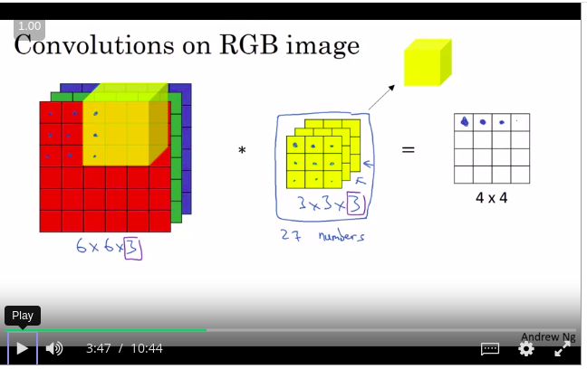
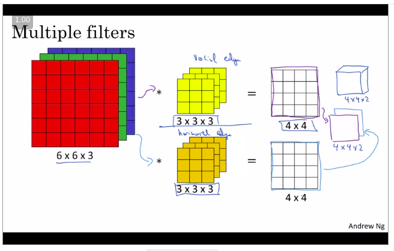
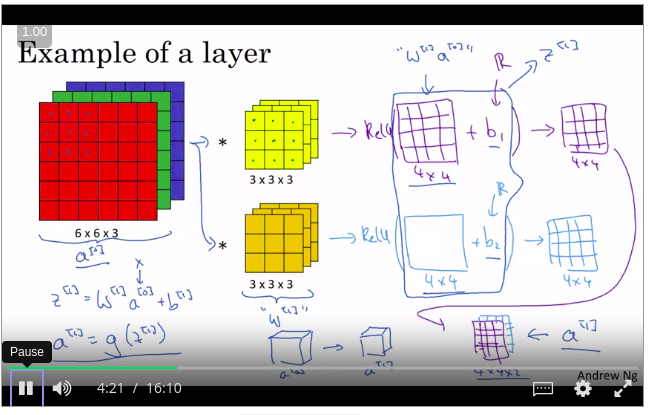
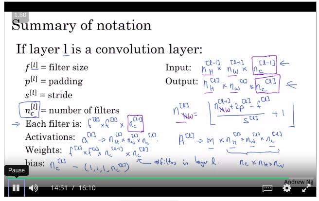
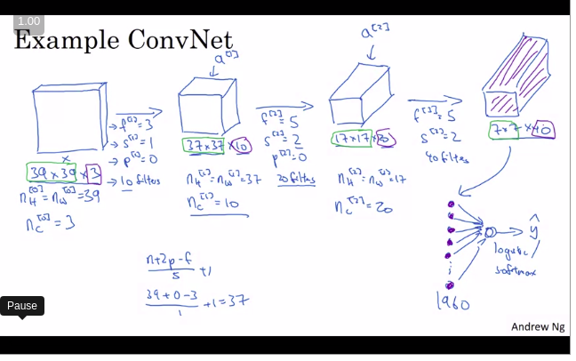
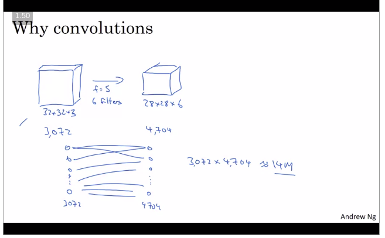
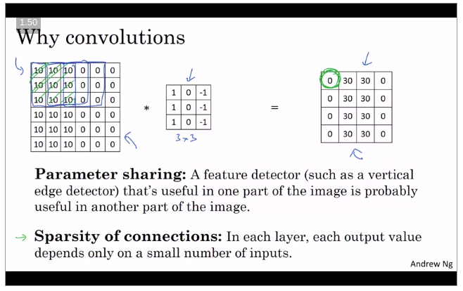
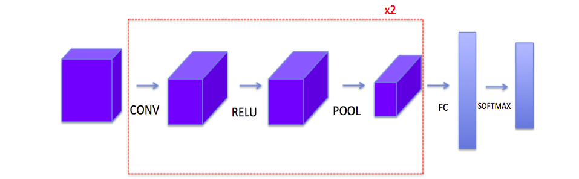

# Convolution Neural Network

#### computer vision and edge detection 

- Edge detection  

  Earlier layer detect images  - > Later Features and then -  > More advanced Features

- Edge Detection using the Filter

- Vertical edges is gap betwenn dark and light pixel  using the filter (Horizontal and vertical edge detection)

- Edge detector filter parameter are trained as weights of NN 

- NN can learn better to handle all types of the filter at every angle rather than manually setting them  

- Formula used for Padding  in images  

- Same padding -  > output size is same as input size 

- Valid Padding  -> Change the size of the output image 

- Strided Convolution : moment of filter on top of image

- Convolution in RGB channel   , filter for each channel in each layer  

  

- can use same filter in all 3 channel or in particular color only

  

## One layer of a convolutional network

Q . 10 filter (3x3X3)  , total number of paramters 3^3+1(bias)=28

 

- Convolution layer and pooling layer is single layer

- As you go deeper the height and with will decrease but channels will increase

- Pooling layers dont have any parameters

- Activation size also goes down slowly  

  ### WHy convolutional Layers  ?

  - the number of paramets is too large othewise 

    the number of parameters in a weight matrix would be 3,072 

    times 4,704 which is about 14 million

- Parameter sharing - using same filter for different edges 
- Sparsity connection - only few parameters needed at a time

## The basics of ConvNets

In lecture we talked about “parameter sharing” as a benefit of using convolutional networks. Which of the following statements about parameter sharing in ConvNets are true?

- It allows a feature detector to be used in multiple locations throughout the whole input image/input volume.
- It reduces the total number of parameters, thus reducing overfitting.

- Convolution functions, including:
  - Zero Padding
  - Convolve window
  - Convolution forward
  - Convolution backward (optional)
- Pooling functions, including:
  - Pooling forward
  - Create mask
  - Distribute value
  - Pooling backward (optional)

The main benefits of padding are the following:

- It allows you to use a CONV layer without necessarily shrinking the height and width of the volumes. This is important for building deeper networks, since otherwise the height/width would shrink as you go to deeper layers. An important special case is the "same" convolution, in which the height/width is exactly preserved after one layer.
- It helps us keep more of the information at the border of an image. Without padding, very few values at the next layer would be affected by pixels as the edges of an image.