# Face Recognition

-  Face recognition + liveness detection to avoid identifying printed  images

  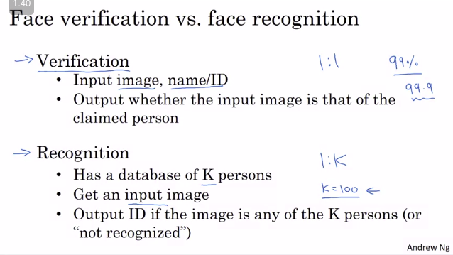

#### One Shot Learning

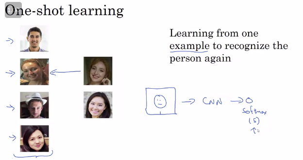

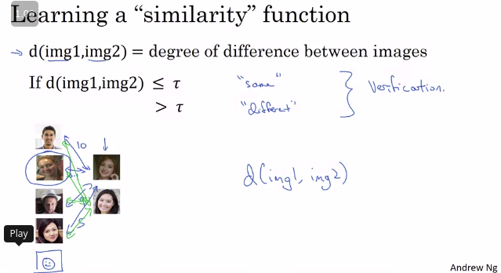

## Siamese Network[image-20200725191804830](image-20200725191804830.png)

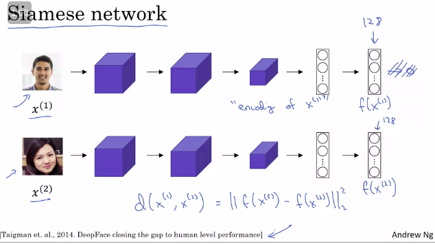

And I'm going to give this list of 128 numbers a name. I'm going to call this f of x1, and you should think of f of x1 as an encoding of the input image x1. So it's taken the input image, here this picture of Kian, and is re-representing it as a vector of 128 numbers. The way you can build a face recognition system is then that if you want to compare two pictures, let's say this first picture with this second picture here. What you can do is feed this second picture to the same neural network with the same parameters and get a different vector of 128 numbers, which encodes this second picture. So I'm going to call this second picture.

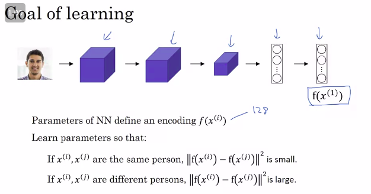

### Triplet Loss

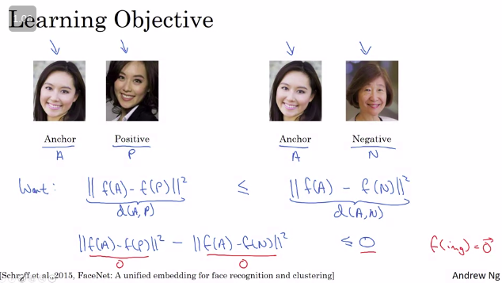

to make sure it dosent give encoding of zero as output  , we modify it to be compared to + alpha 

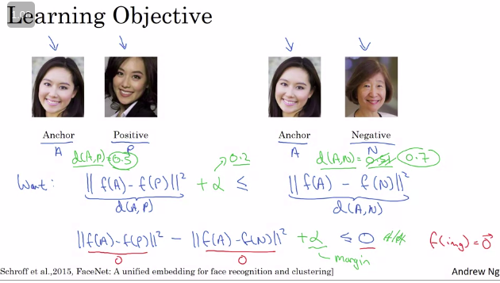

by adding the value it pushes the anchor values away from each other  

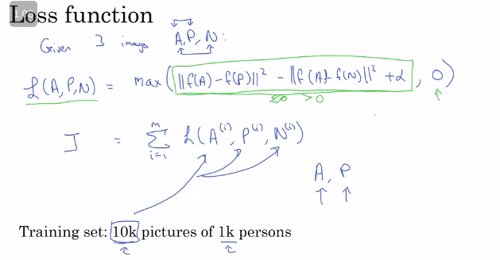

choose hard triplets for better training  , source paper listed below on facenet

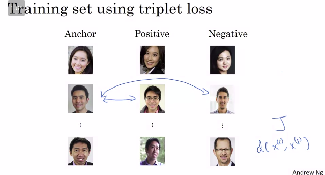

### Face Verification and Binary Classification

Turning triples loss function into the binary classification problem ,using logistic regression to classify  it into either zero or one , 

Vide : https://www.youtube.com/watch?v=GWa9xsMU0Pg

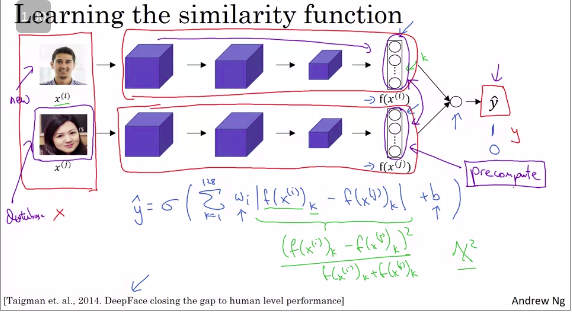

Precompute the values so that  you dont have to calculate the values everytime 

## Neural Style Transfer

-  transfer the style from one image to the another images

  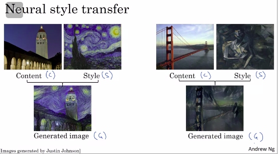

## What are deep ConvNets learning?

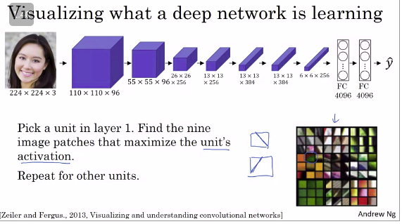

to find how what activates the hidden units , deeper layer have more clear idea and understanding

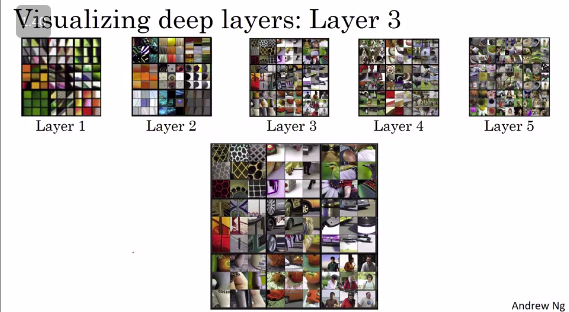

## Cost Function for Neural Style Transfer

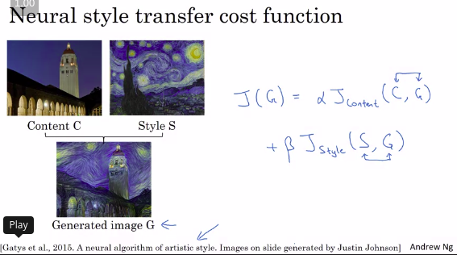

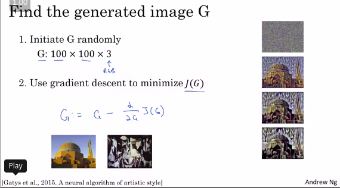

## Content Cost Function

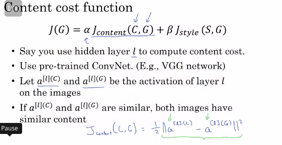

## Style Cost Function

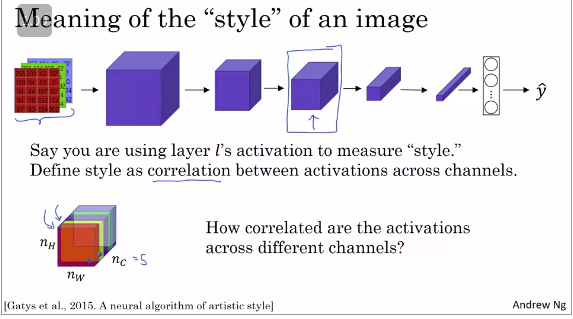

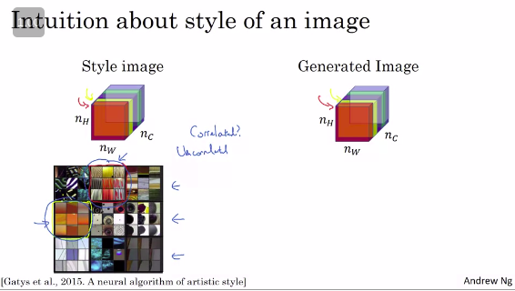

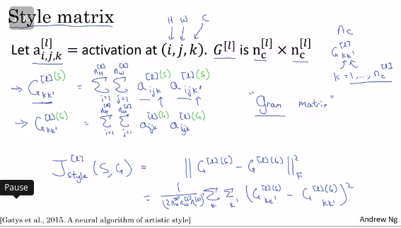

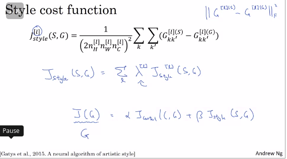

#### 1D and 3D Generalizations

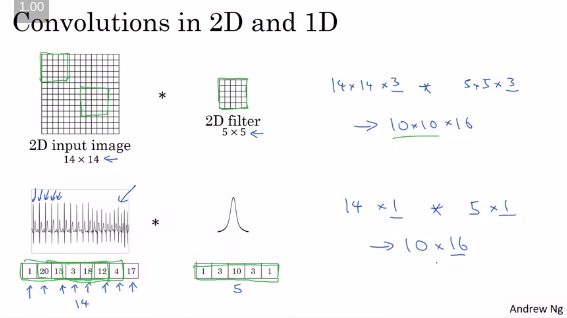

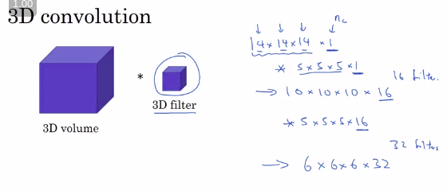