## Object Localization 

- Object detection starts with object localization
- Localization :  Identifying and marking object in the Image which is in middle and visible clearly  
- In detection multiple objects of that type will be visible in the example image
- Bounding Box of highlighting the area of the images 

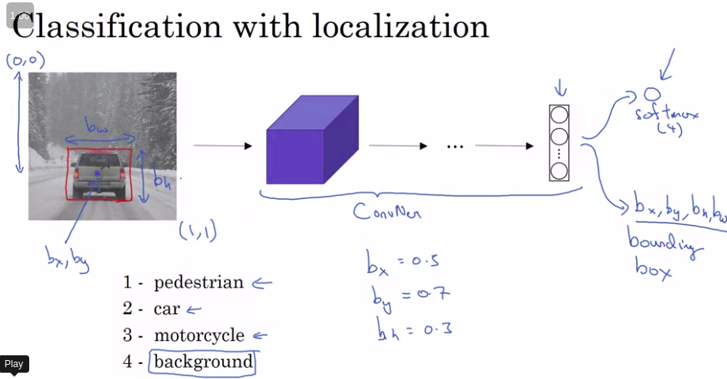

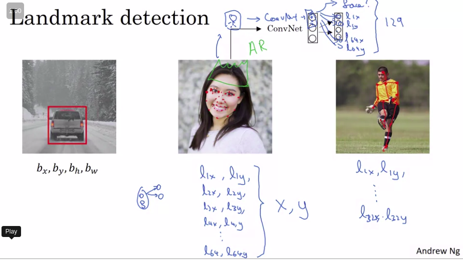

### Sliding Window detection

used earlier with linear function and classifier , but convnets this way is slow

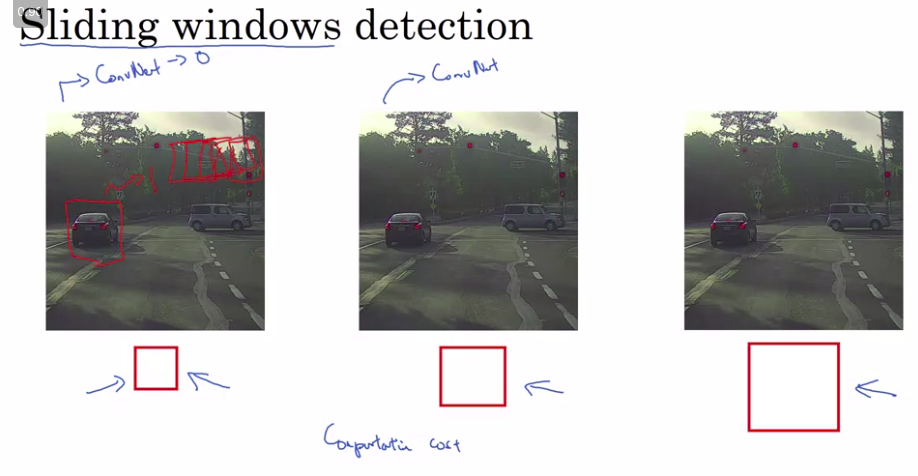

solution 

- Convert fully connected layer to convolution layers

  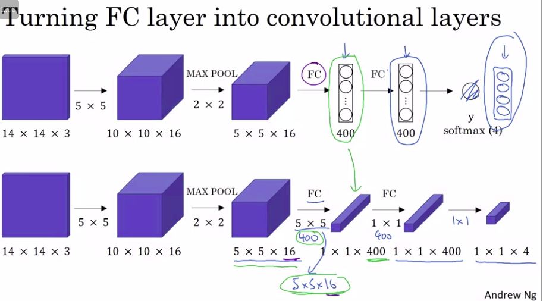

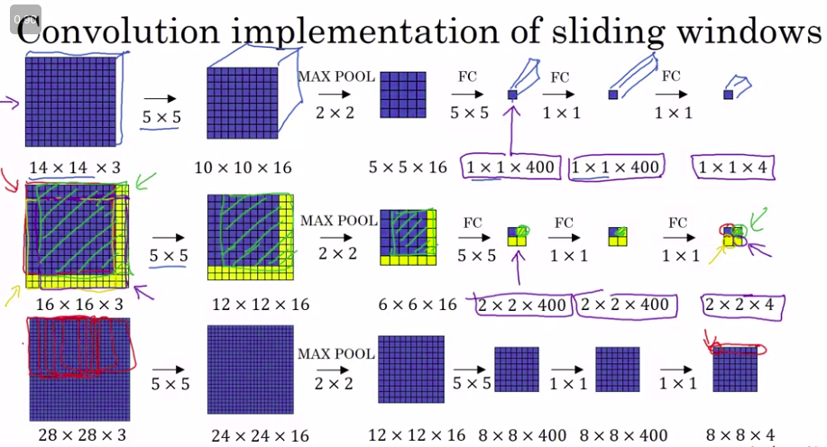

Computationally expensive and not accurate

### Bounding box Prediction - YOLO

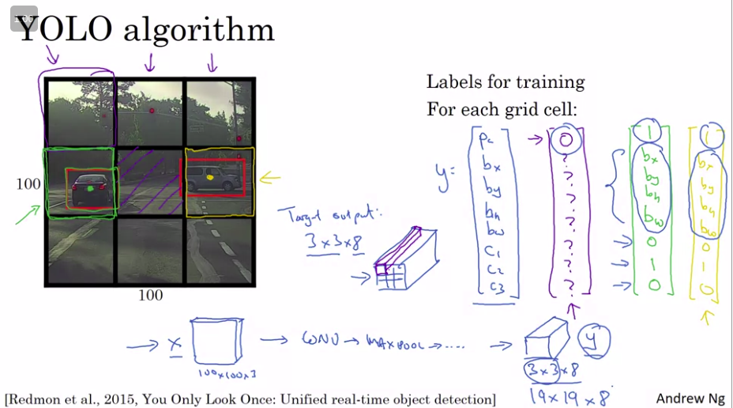

Finding the mid point of the object and then deciding which  grid cell it belongs too

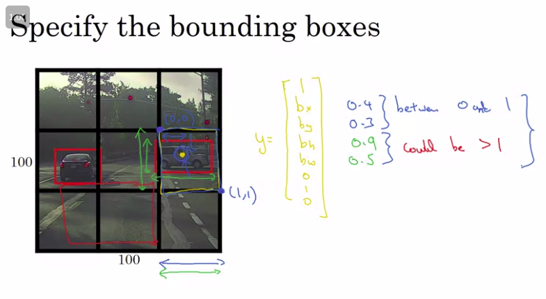

YOLO is a tough paper to understand 

## Intersection over Union

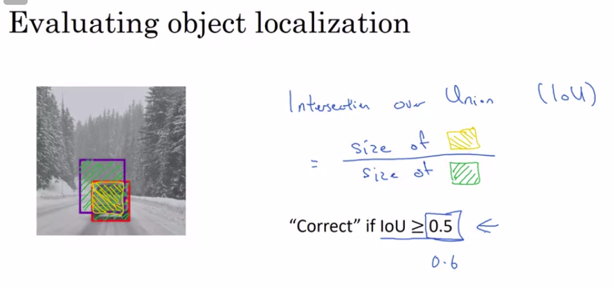

Using Intersection of actual and output localization to check for accuracy 

## Non Max supression

to solve the problem of detecting the same object multiple times in an image ,by looking at high probability localization and then one with high overlap get supressed (suppress that are non max)

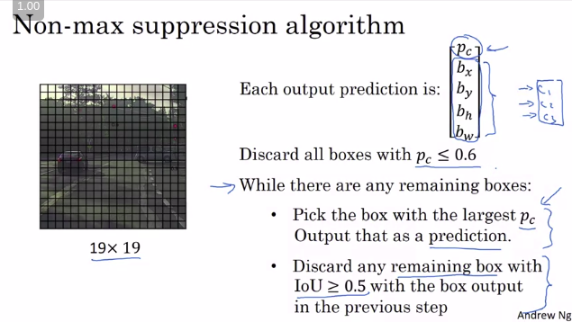

 ## Anchor Boxes to solve overlapping objects

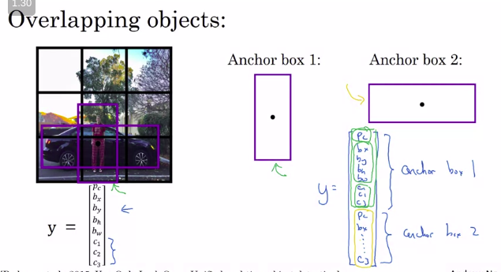

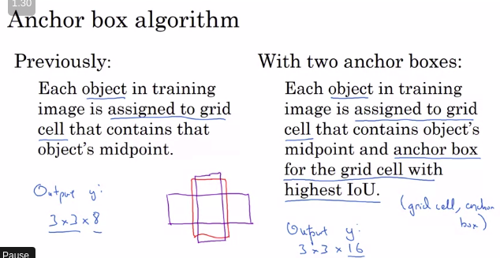

## Yolo Algorithm

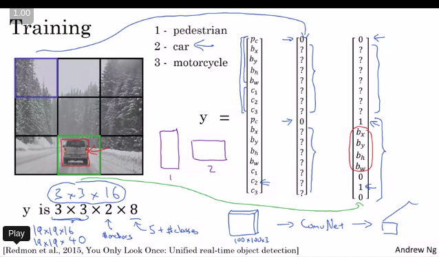

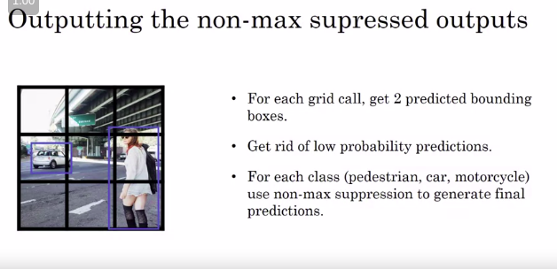

## Region Proposal (optional)

- Run a segmentation algorithm  

  

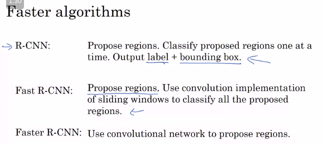